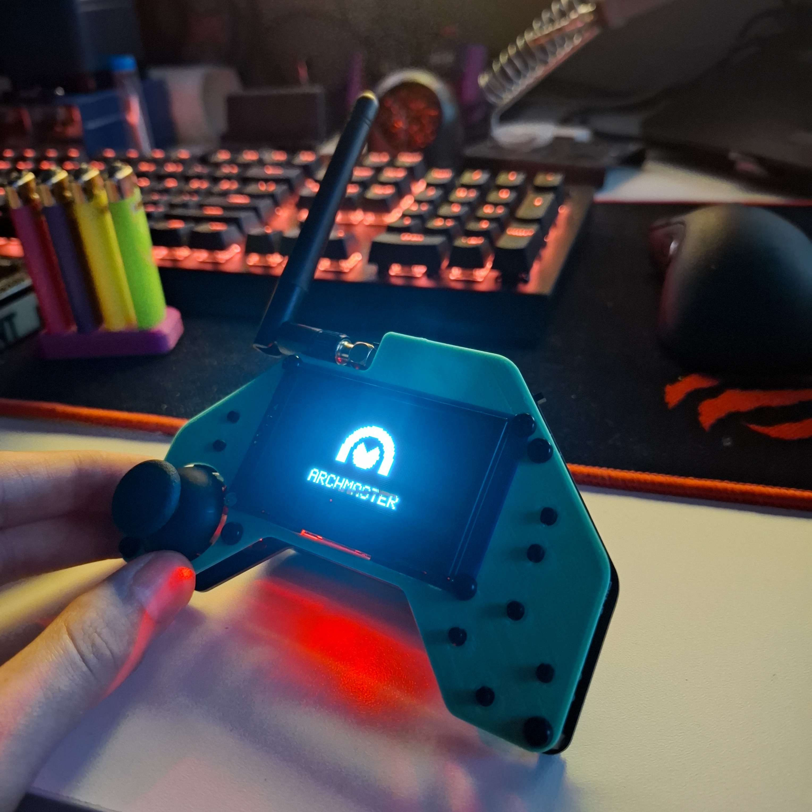

# 🕹️ Custom NRF Controller for Robot

This repository documents a **custom-made controller** that communicates with a robot via **NRF radio module**. The controller sends movement and weapon control data, while receiving feedback from the robot including **gyro orientation** (whether it's upside down), and **battery levels** for both Li-ion and LiPo power sources.

---

## 📦 System Overview

### Controller
- NRF24L01+ Radio Module
- User inputs (joysticks, buttons/switches)
- OLED Display
- Powered by Li-ion battery

### Robot
- NRF24L01+ Receiver
- Motor and weapon drivers
- IMU (gyroscope)
- Battery monitoring circuit (Li-ion + LiPo)

---

## 📡 Communication Protocol

### 📤 Controller → Robot (TX)

Sent periodically (e.g., 20 Hz):

| Field         | Type   | Range/Notes                      |
|---------------|--------|----------------------------------|
| `move_speed`  | `int8` | -100 (backward) to +100 (forward) |
| `weapon_speed`| `int8` | -100 to +100                     |

### 📥 Robot → Controller (RX)

Returned periodically:

| Field             | Type   | Description                         |
|------------------|--------|-------------------------------------|
| `is_upside_down` | `bool` | `true` if robot is flipped          |
| `battery_liion`  | `uint8`| 0–100% battery percentage           |
| `battery_lipo`   | `uint8`| 0–100% battery percentage           |
| `gyro_status`    | `int16`| Raw orientation/angle value         |

---

## 🎮 Controller Input Mapping

| Control       | Function          |
|---------------|-------------------|
| Left Joystick | Move forward/backward |
| Button A      | weapon            |
| Button B      | Emergency stop    |

---

## 🖥️ Display Features

- **Battery Status**
  - Li-ion (controller) and LiPo (robot) levels shown as percentages
- **Gyro Orientation**
  - Alert/message when robot is upside down
- **Command Echo**
  - Show last movement/weapon control sent

---

## 🔋 Battery Handling

### Controller:
- Powered by **Li-ion battery**
- Battery level estimated using voltage-to-percentage mapping

### Robot:
- **Li-ion**: Logic and sensors
- **LiPo**: Motors and high-power systems
- Both battery levels are reported back to the controller for display

---

## 🛠️ Notes

- Ensure NRF configurations (channel, payload size, data rate) match on both sides.
- Display should sleep after inactivity to save power.
- Communication is handled via reliable NRF packet protocols (with acknowledgment if needed).

### 📷 Controller

---
